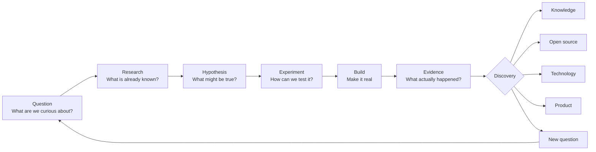

<!-- Organization profile README -->

# Independent Research Lab

### Curiosity → Research → Experiment → Build

**Explore what we don't fully understand. Build to find out.**

*Jakarta, Indonesia · Founded 2025*

[Repositories](https://github.com/orgs/Vellixia/repositories) · [Contact](mailto:andresholivin01@gmail.com)

---

## From Curiosity to Creation

> ### What happens if we try this?

We do not start with a product.  
We start with a **question worth testing**.

> **Not every experiment needs to become a product.**  
> An experiment that gives us reliable knowledge is already useful.

### What can come out of the lab?

**Knowledge** — something we understand better  
**Open source** — something others can build on  
**Technology** — a capability we can reuse  
**Product** — something useful in the real world  
**New questions** — another direction worth exploring

### What do we explore?

`AI` · `Software` · `Hardware` · `Interactive Systems` · `Anything worth testing`

We are not tied to one technology or field. The subject can change; the way we work should remain the same.

> **Turn curiosity into knowledge, knowledge into experiments, and the strongest experiments into meaningful creations.**

---

## Contributing

Ideas, experiments, issues, and contributions are welcome.

See [CONTRIBUTING.md](https://github.com/Vellixia/.github/blob/main/CONTRIBUTING.md) and [CODE_OF_CONDUCT.md](https://github.com/Vellixia/.github/blob/main/CODE_OF_CONDUCT.md).

Found a security issue? See [SECURITY.md](https://github.com/Vellixia/.github/blob/main/SECURITY.md).
